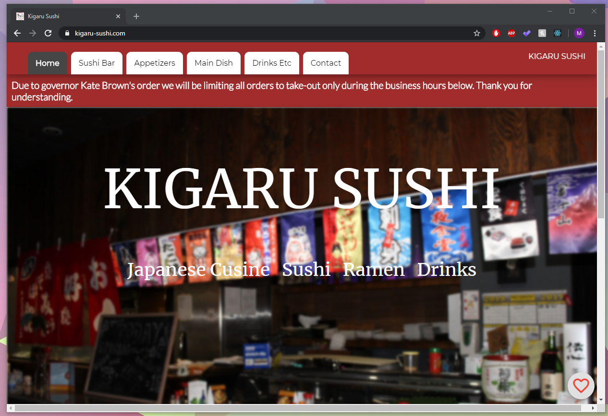
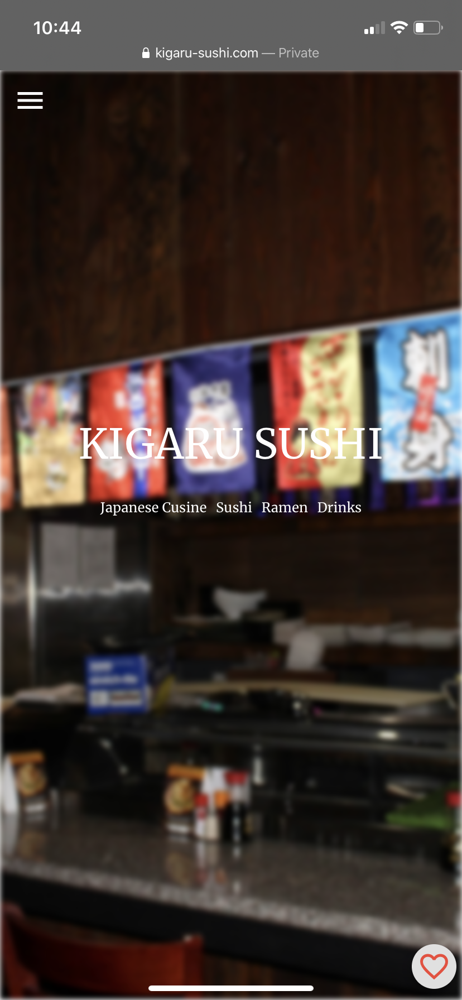

## Introduction
(This webpage is now deprecated)
This website was built for the Kigaru Sushi restaurant located in Beaverton, Oregon. Accompanied with a serverless MongoDB and AWS backend, this website dynamically renders content from the data that is manipulated from this [management repo](https://github.com/mark-huynh/kigaru-manager). 

Desktop and Mobile:

   

## Features

Website was first developed during the summer of 2019 as a completely static site with updates only being done via Git with a Electron GUI. In 2020, I decided to integrate a backend and the details can be found in the management repo linked in the intro. 

This webpage renders its content dynamically and is cross platform compatible for both mobile and desktop. Webpage utilizes client side routing, so data is only fetched once after a user enters the page or hard refreshes. 

React Redux was used in order to incorporate 'Favorites,' allowing users to save items they would like to potentially order when they come into the restaurant.

 

Within the favorites, the user has the ability to determine the final cost of their potential meal, remind themselves of the details of the item as well as see any available images of their items.

 

Additionally, these favorites persist. Even after refreshing or leaving the page, the favorites will remain. This is ideal for selecting items ahead of time and keeping it on a user's device for later visits.

 
